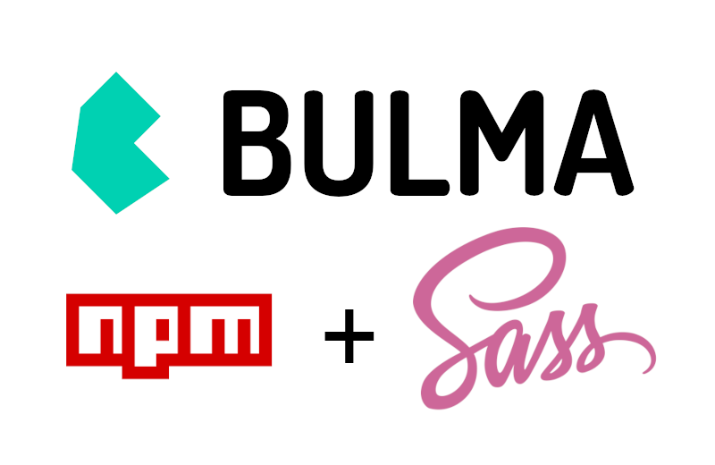
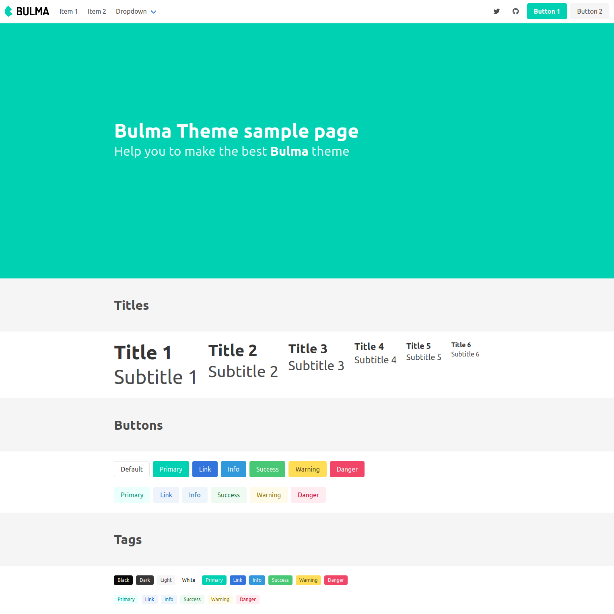
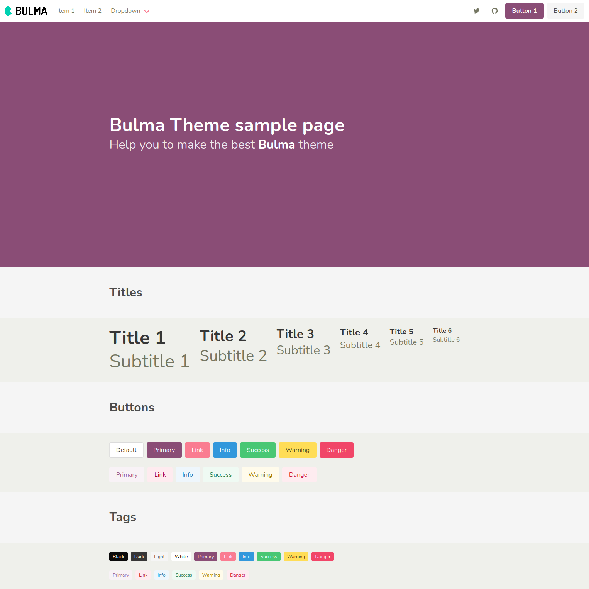

# bulma-npm-theme
Build a theme from Bulma with npm and Sass



## Intro

The goal is to generate a **custom Bulma CSS file** that fits your needs, and you can use for any website.

To achieve that, you will need **Node.js and npm** (if you have not them please check how to install them ).

This project uses  instead of the deprecated .


## Installation

Clone or download this project, then open a **terminal** or **console**, and navigate to the bulma-npm-theme folder :

```
$ npm install
```

This will install all the project's dependencies.

## Run and customize !

There is only one **npm command** to know to run the project :

```
$ npm run start
```

This will build the Bulma theme CSS file, then watch for updates and open the browser. You should see a sample page with some **default Bulma layouts and components** :



Now you want to do your theme, so edit the file **sass/bulma-theme.scss** and uncomment the example (taken from the official documentation). Reload the browser page, the modifications should be there :



You can update Bulma variables (check the list ), update or add your own classes.

## Use your theme

The theme is in the file **css/bulma-theme.css**, you can copy this file and use it in your web site / web app.
